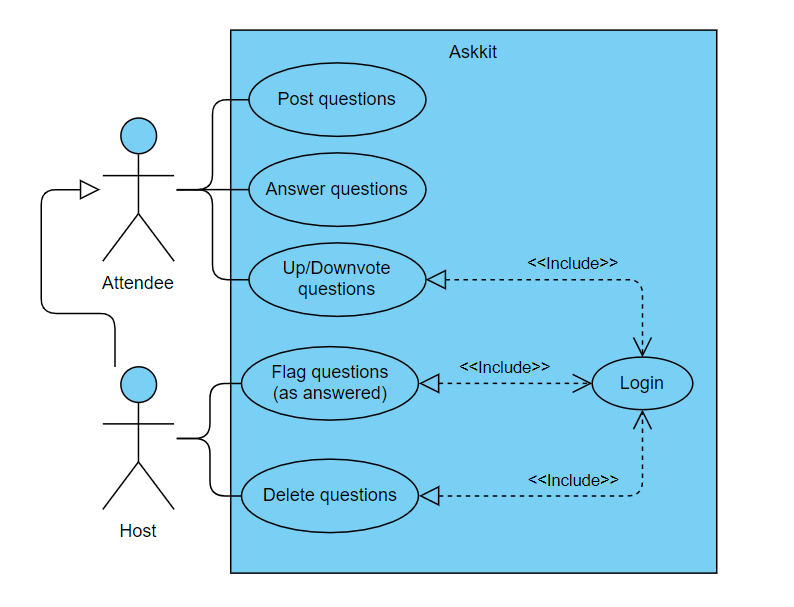
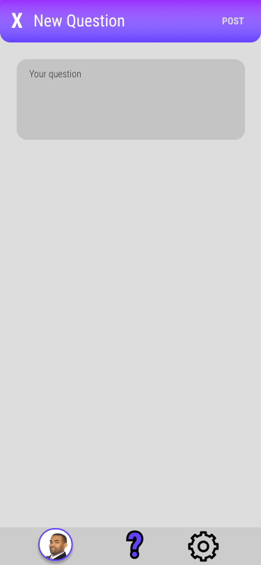
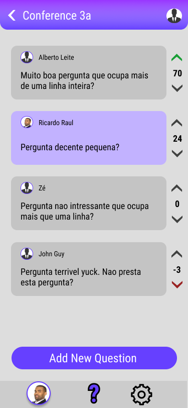
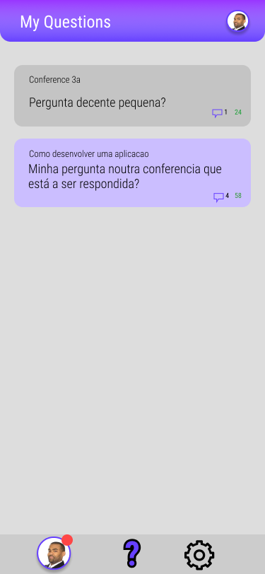
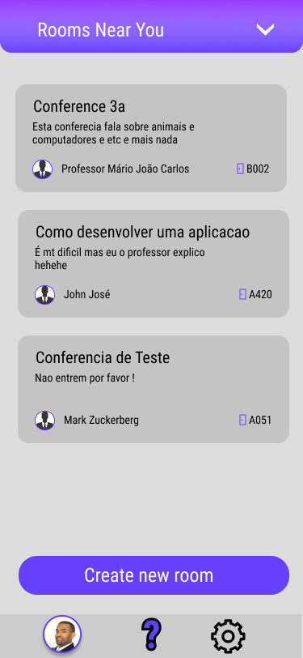

# openCX-jakepaulers Development Report

Welcome to the documentation pages of the Askkit of **openCX**!

You can find here detailed about the (sub)product, hereby mentioned as module, from a high-level vision to low-level implementation decisions, a kind of Software Development Report (see [template](https://github.com/softeng-feup/open-cx/blob/master/docs/templates/Development-Report.md)), organized by discipline (as of RUP): 

* Business modeling 
  * [Product Vision](#Product-Vision)
  * [Elevator Pitch](#Elevator-Pitch)
* Requirements
  * [Use Case Diagram](#Use-case-diagram)
  * [User stories](#User-stories)
  * [Domain model](#Domain-model)
* Architecture and Design
  * [Logical architecture](#Logical-architecture)
  * [Physical architecture](#Physical-architecture)
  * [Prototype](#Prototype)
* [Implementation](#Implementation)
* [Test](#Test)
* [Configuration and change management](#Configuration-and-change-management)
* [Project management](#Project-management)

So far, contributions are exclusively made by the initial team, but we hope to open them to the community, in all areas and topics: requirements, technologies, development, experimentation, testing, etc.

Please contact us! 

Thank you!

*Daniel Brandão, Henrique Santos, João Leite, Pedro Moás*

---

## Product Vision

The goal is to make host-atendee interaction simple. Users post relevant questions and the audience can vote and reply. The conference host may choose to answer the most popular ones.

<!-- Start by defining a clear and concise vision for your module, to help members of the team, contributors, and users into focusing their often disparate views into a concise, visual, and short textual form. It provides a "high concept" of the product for marketers, developers, and managers.
A product vision describes the essential of the product and sets the direction to where a product is headed, and what the product will deliver in the future.

To learn more about how to write a good product vision, please see also:
* [How To Create A Convincing Product Vision To Guide Your Team, by uxstudioteam.com](https://uxstudioteam.com/ux-blog/product-vision/)
* [Product Management: Product Vision, by ProductPlan](https://www.productplan.com/glossary/product-vision/)
* [Vision, by scrumbook.org](http://scrumbook.org/value-stream/vision.html)
* [How to write a vision, by dummies.com](https://www.dummies.com/business/marketing/branding/how-to-write-vision-and-mission-statements-for-your-brand/)
* [20 Inspiring Vision Statement Examples (2019 Updated), by lifehack.org](https://www.lifehack.org/articles/work/20-sample-vision-statement-for-the-new-startup.html)
 -->

---
## Elevator Pitch

Most conference Q&A's suffer from a common problem: There is no way for the host to focus on the most relevant questions, so those may end up unanswered. That's why we decided to end this problem, by creating Askkit, a mobile app targeted towards conference atendees that allows them to post their questions for every other user to see. That way, they may vote for the ones they want to see answered, and flag the ones they find less relevant. That way, a speaker can be aware of what topics to tackle during the Q&A session.

<!--
Draft a small text to help you quickly introduce and describe your product in a short time and a few words, a technique usually known as elevator pitch.

Take a look at the following links to learn some techniques:
* [Crafting an Elevator Pitch](https://www.mindtools.com/pages/article/elevator-pitch.htm)
* [The Best Elevator Pitch Examples, Templates, and Tactics - A Guide to Writing an Unforgettable Elevator Speech, by strategypeak.com](https://strategypeak.com/elevator-pitch-examples/)
* [Top 7 Killer Elevator Pitch Examples, by toggl.com](https://blog.toggl.com/elevator-pitch-examples/)
-->
---
## Requirements

In this section, you should describe all kinds of requirements for your module: functional and non-functional requirements.

Start by contextualizing your module, describing the main concepts, terms, roles, scope and boundaries of the application domain addressed by the project.

### Use case diagram 

Create a use-case diagram in UML with all high-level use cases possibly addressed by your module.

Give each use case a concise, results-oriented name. Use cases should reflect the tasks the user needs to be able to accomplish using the system. Include an action verb and a noun. 

Briefly describe each use case mentioning the following:

* **Actor**. Name only the actor that will be initiating this use case, i.e. a person or other entity external to the software system being specified who interacts with the system and performs use cases to accomplish tasks. 
* **Description**. Provide a brief description of the reason for and outcome of this use case, or a high-level description of the sequence of actions and the outcome of executing the use case. 
* **Preconditions and Postconditions**. Include any activities that must take place, or any conditions that must be true, before the use case can be started (preconditions) and postconditions. Describe also the state of the system at the conclusion of the use case execution (postconditions). 

* **Normal Flow**. Provide a detailed description of the user actions and system responses that will take place during execution of the use case under normal, expected conditions. This dialog sequence will ultimately lead to accomplishing the goal stated in the use case name and description. This is best done as a numbered list of actions performed by the actor, alternating with responses provided by the system. 
* **Alternative Flows and Exceptions**. Document other, legitimate usage scenarios that can take place within this use case, stating any differences in the sequence of steps that take place. In addition, describe any anticipated error conditions that could occur during execution of the use case, and define how the system is to respond to those conditions.

#### Post Questions:

*  **Actor**. Conference attendee.

*  **Description**. This use case exists so that the attendee can upload their questions into the database to later be answered.

*  **Preconditions and Postconditions**.  In order to post a question, the attendee must first join a conference's forum. In the end, the user's question will be added to the database, and displayed on the forum.
  
*  **Normal Flow**. 
	1. The attendee presses the button to add a question to a forum.
	2. The attendee types his question.
	3. If it's within the allowed length, the system saves the question to the database, and displays it on the forum.

*  **Alternative Flows and Exceptions**. 
	1. The attendee presses the button to add a question to a forum.
	2. The attendee types his question.
	3. If the question is too long, the system will respond with an error message.
	4. The user can then retype his question, and proceed as normal.

#### Answer Questions:

*  **Actor**. Conference attendee.

*  **Description**. This use case exists so that an attendee can answer other user's questions.

*  **Preconditions and Postconditions**.  In order to answer a question, the attendee must first join a conference's forum. In the end, the user's answer will be added to the database, and displayed as a reply to the chosen question.

*  **Normal Flow**. 
	1. The attendee selects a question he wants to answer.
	2. The attendee types his answer.
	3. If it's within the allowed length, the system saves the answer to the database, and displays it as a reply to the selected question.

*  **Alternative Flows and Exceptions**. 
	1. The attendee selects a question he wants to answer.
	2. The attendee types his answer.
	3. If the answer exceeds the character limit, the system sends and error message.
	4. The user can then retype his answer and proceed as normal.

#### Up/Downvote Questions:

*  **Actor**. Conference attendee.

*  **Description**. This use case exists so authenticated attendees can help filter good and bad questions.

*  **Preconditions and Postconditions**.  In order to up or downvote a question/answer, the attendee must be logged in. After voting, the vote will then be added to the total count.

*  **Normal Flow**. 
	1. The attendee presses the up or downvote button.
	2. If the user is correctly authenticated, the system adds the vote to the current totals.

*  **Alternative Flows and Exceptions**. 
	1. The attendee presses the up or downvote button.
	2. If the user isn't logged in, the system will prompt them to do so.
	3. After successfully logging in, the vote is counted.

#### Flag Questions:

*  **Actor**. Conference host.

*  **Description**. This use case exists so conference hosts can flag questions as having received a satisfactory answer.

*  **Preconditions and Postconditions**.  In order to flag a question, the host must be logged in. In the end, the question will be marked as answered, with the answer in question highlighted.

*  **Normal Flow**. 
	1. The host chooses a question.
	2. The host, as an attendee, posts an answer to the question.
	3. If the host is correctly logged in, they can highlight their own answer, and the system will flag the question as answered.

*  **Alternative Flows and Exceptions**. 
	1. The host chooses a question.
	2. The host, as an attendee, posts an answer to the question.
	3. If the host isn't correctly logged in, the system will prompt them to do so.
	4. After logging in, they can proceed as normal.
*  **OR** 
	1. The host chooses a question.
	2. The host, chooses an answer he finds adequate.
	3. If the host is correctly logged in, they can highlight the answer, and the system will flag the question as answered.
	
#### Delete Questions:

*  **Actor**. Conference host.

*  **Description**. This use case exists so conference hosts can delete questions that are not relevant to the topic at hand.

*  **Preconditions and Postconditions**.  In order to delete a question, the host must be logged in. In the end, the selected question will be removed.

*  **Normal Flow**. 
	1. The host chooses a question.
	2. If the host is correctly logged in, they can signal the system to remove it.
	3. The system removes the question from the database.

*  **Alternative Flows and Exceptions**. 
	1. The host chooses a question.
	2. If the host isn't correctly logged in, the system will prompt them to do so.
	3. After logging in, they can proceed as normal.
	

### User stories

#### Story

As a conference atendee, I want to be able to easily ask questions to the host, so that I get to understand the subject better and faster.

**User interface mockup**

**Acceptance tests**

For each user story you should write also the acceptance tests (textually in Gherkin), i.e., a description of scenarios (situations) that will help to confirm that the system satisfies the requirements addressed by the user story.

**Value and effort**

Value: Must have

Effort: XL

#### Story

As a conference host, I want my audience to be able to assist each other on questions they might have, so that I'll have more time to explain other harder questions.

**User interface mockup**

**Acceptance tests**

For each user story you should write also the acceptance tests (textually in Gherkin), i.e., a description of scenarios (situations) that will help to confirm that the system satisfies the requirements addressed by the user story.

**Value and effort**

Value: Should have

Effort: L

#### Story

As a user, I want to be able to upvote questions I find relevant, and downvote questions I find off-topic, so that the time is used to answer questions that people find the most important.

**User interface mockup**

**Acceptance tests**

For each user story you should write also the acceptance tests (textually in Gherkin), i.e., a description of scenarios (situations) that will help to confirm that the system satisfies the requirements addressed by the user story.

**Value and effort**

Value: Must have

Effort: XL

#### Story

As an attendee, I want to be notified when my questions are being answered or verified by the host, so that I don't have to keep the app open until something happens.

**User interface mockup**

**Acceptance tests**

For each user story you should write also the acceptance tests (textually in Gherkin), i.e., a description of scenarios (situations) that will help to confirm that the system satisfies the requirements addressed by the user story.

**Value and effort**

Value: Could have

Effort: S

#### Story

As an attendee, I want to be automatically entered into the forum corresponding to the conference I'm currently attending, so that I don't need to waste time joining a room every time I open the app.

**User interface mockup**

**Acceptance tests**

For each user story you should write also the acceptance tests (textually in Gherkin), i.e., a description of scenarios (situations) that will help to confirm that the system satisfies the requirements addressed by the user story.

**Value and effort**

Value: Could have

Effort: M

<!--
This section will contain the requirements of the product described as **user stories**, organized in a global **user story map** with **user roles** or **themes**.

For each theme, or role, you may add a small description. User stories should be detailed in the tool you decided to use for project management (e.g. trello or github projects).

A user story is a description of desired functionality told from the perspective of the user or customer. A starting template for the description of a user story is 

*As a < user role >, I want < goal > so that < reason >.*

**INVEST in good user stories**. 
You may add more details after, but the shorter and complete, the better. In order to decide if the user story is good, please follow the [INVEST guidelines](https://xp123.com/articles/invest-in-good-stories-and-smart-tasks/).

**User interface mockups**.
After the user story text, you should add a draft of the corresponding user interfaces, a simple mockup or draft, if applicable.

**Acceptance tests**.
For each user story you should write also the acceptance tests (textually in Gherkin), i.e., a description of scenarios (situations) that will help to confirm that the system satisfies the requirements addressed by the user story.

**Value and effort**.
At the end, it is good to add a rough indication of the value of the user story to the customers (e.g. [MoSCoW](https://en.wikipedia.org/wiki/MoSCoW_method) method) and the team should add an estimation of the effort to implement it, for example, using t-shirt sizes (XS, S, M, L, XL).
-->

### Domain model

To better understand the context of the software system, it is very useful to have a simple UML class diagram with all the key concepts (names, attributes) and relationships involved of the problem domain addressed by your module.

---

## Architecture and Design
The architecture of a software system encompasses the set of key decisions about its overall organization. 

A well written architecture document is brief but reduces the amount of time it takes new programmers to a project to understand the code to feel able to make modifications and enhancements.

To document the architecture requires describing the decomposition of the system in their parts (high-level components) and the key behaviors and collaborations between them. 

In this section you should start by briefly describing the overall components of the project and their interrelations. You should also describe how you solved typical problems you may have encountered, pointing to well-known architectural and design patterns, if applicable.

### Logical architecture
The purpose of this subsection is to document the high-level logical structure of the code, using a UML diagram with logical packages, without the worry of allocating to components, processes or machines.

It can be beneficial to present the system both in a horizontal or vertical decomposition:
* horizontal decomposition may define layers and implementation concepts, such as the user interface, business logic and concepts; 
* vertical decomposition can define a hierarchy of subsystems that cover all layers of implementation.

### Physical architecture
The goal of this subsection is to document the high-level physical structure of the software system (machines, connections, software components installed, and their dependencies) using UML deployment diagrams or component diagrams (separate or integrated), showing the physical structure of the system.

It should describe also the technologies considered and justify the selections made. Examples of technologies relevant for openCX are, for example, frameworks for mobile applications (Flutter vs ReactNative vs ...), languages to program with microbit, and communication with things (beacons, sensors, etc.).

### Prototype
To help on validating all the architectural, design and technological decisions made, we usually implement a vertical prototype, a thin vertical slice of the system.

In this subsection please describe in more detail which, and how, user(s) story(ies) were implemented.

---

## Implementation
During implementation, while not necessary, it 

It might be also useful to explain a few aspects of the code that have the greatest potential to confuse software engineers about how it works. 

Since the code should speak by itself, try to keep this section as short and simple as possible.

Use cross-links to the code repository and only embed real fragments of code when strictly needed, since they tend to become outdated very soon.

---
## Test

There are several ways of documenting testing activities, and quality assurance in general, being the most common: a strategy, a plan, test case specifications, and test checklists.

In this section it is only expected to include the following:
* test plan describing the list of features to be tested and the testing methods and tools;
* test case specifications to verify the functionalities, using unit tests and acceptance tests.
 
A good practice is to simplify this, avoiding repetitions, and automating the testing actions as much as possible.

---
## Configuration and change management

Configuration and change management are key activities to control change to, and maintain the integrity of, a project’s artifacts (code, models, documents).

For the purpose of ESOF, we will use a very simple approach, just to manage feature requests, bug fixes, and improvements, using GitHub issues and following the [GitHub flow](https://guides.github.com/introduction/flow/).

---

## Project management

Software project management is an art and science of planning and leading software projects, in which software projects are planned, implemented, monitored and controlled.

In the context of ESOF, we expect that each team adopts a project management tool capable of registering tasks, assign tasks to people, add estimations to tasks, monitor tasks progress, and therefore being able to track their projects.

Example of tools to do this are:
  * [Trello.com](https://trello.com)
  * [Github Projects](https://github.com/features/project-management/com)
  * [Pivotal Tracker](https://www.pivotaltracker.com)
  * [Jira](https://www.atlassian.com/software/jira)

We recommend to use the simplest tool that can possibly work for the team.